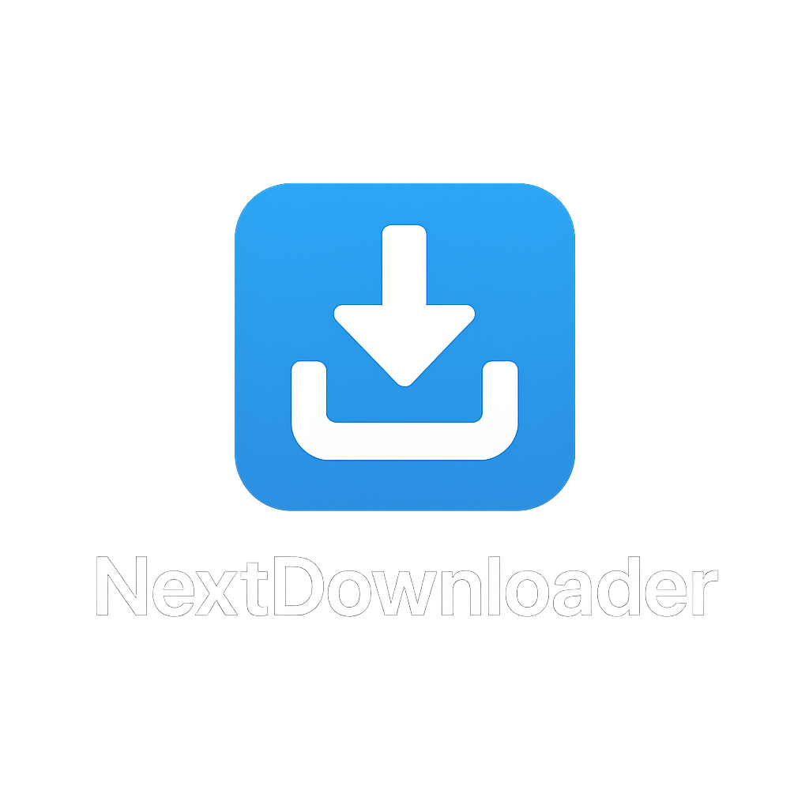

# NextDownloader

高性能なマルチメディアダウンローダーアプリケーション



## 概要

NextDownloaderは、Mac用の高性能ダウンローダーです。Rustの高速な処理能力とFlutterの美しいUIを組み合わせ、大容量ファイルやストリーミングメディアを迅速にダウンロードすることができます。

### 主な機能

- **高速ダウンロード**: 2-5GBの高画質動画ファイルも高速にダウンロード
- **ストリーミングサポート**: HLS/DASHストリーミングをサポート
- **DRM認証対応**: ログイン後の動画ストリームレコーディング
- **レジューム機能**: ダウンロードが途切れた場合に再開可能
- **H.265変換**: オプションでH264動画をH.265に圧縮して保存

## プロジェクト構造

```
nextdownloader/
├── core/                # Rustコアライブラリ
│   ├── src/             # Rustソースコード
│   └── Cargo.toml       # Rust依存関係
├── ffi/                 # Rust-Dart FFIレイヤー
│   ├── src/             # FFIソースコード
│   └── Cargo.toml       # FFIの依存関係
├── flutter_app/         # Flutterアプリケーション
│   ├── lib/             # Dartソースコード
│   ├── macos/           # macOS固有の設定
│   └── pubspec.yaml     # Flutter依存関係
├── Cargo.toml           # ワークスペース設定
└── README.md            # このファイル
```

## 開発環境の設定

### 前提条件

- Rust 1.70以上
- Flutter 3.10以上
- Xcode 14以上 (macOSの場合)
- Visual Studio 2022 (Windowsの場合)

### ビルド手順

1. Rustツールチェーンのインストール:
   ```
   curl --proto '=https' --tlsv1.2 -sSf https://sh.rustup.rs | sh
   ```

2. Flutter SDKのインストール:
   Flutter公式サイトからダウンロードしてインストール

3. 依存関係のインストール:
   ```
   cargo install flutter_rust_bridge_codegen
   ```

4. プロジェクトのビルド:
   ```
   cd flutter_app
   flutter pub get
   cd ../
   cargo build --release
   cd flutter_app
   flutter run
   ```

## ライセンス

MIT License - 詳細はLICENSEファイルを参照してください。

## 貢献

バグの報告や機能のリクエストは、Issueを通じてお願いいたします。
プルリクエストも歓迎します！